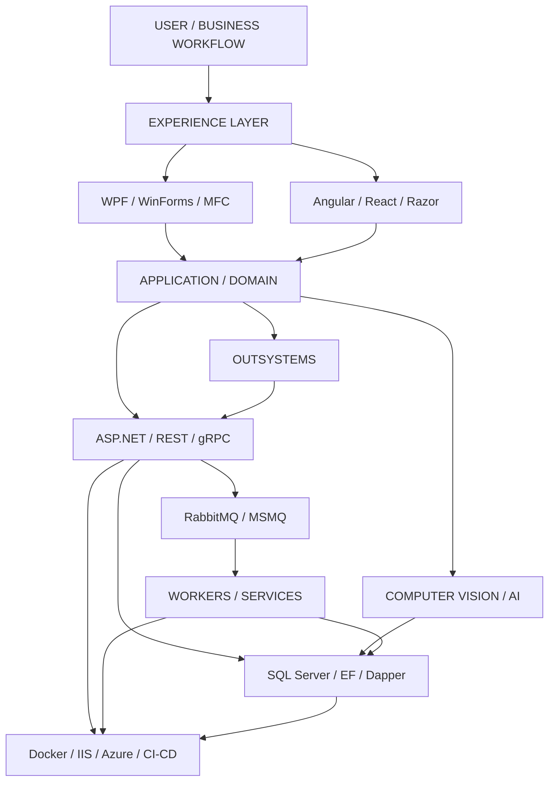
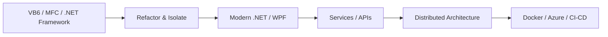

<div align="center">


<a href="https://github.com/PeterBushra"></a>

<br />


<br /><br />

[](https://github.com/PeterBushra)
[](https://www.linkedin.com/in/peterboshra/)

</div>

---

## `> whoami`

I am a **Senior Software Engineer** focused on building software that is technically strong, performant, maintainable, and intuitive to use.

My work spans **software architecture, high-performance desktop applications, enterprise .NET, C++, computer vision, AI/ML, modern web applications, distributed systems, GIS, cloud infrastructure and OutSystems**.

I work across the complete engineering path:

<div align="center">

`UNDERSTAND` → `DESIGN` → `ARCHITECT` → `BUILD` → `MEASURE` → `OPTIMIZE` → `DEPLOY`

</div>

---

## `WHAT.MAKES.ME.PROFESSIONAL`

<table>
<tr>
<td width="50%" valign="top">

### 01 · SYSTEM THINKING

I understand how **UI, application logic, data, services, messaging, infrastructure and business rules** interact instead of optimizing one isolated layer.

### 02 · ARCHITECTURE

I build around **clear boundaries, SOLID principles, separation of concerns and maintainable abstractions**, while remaining practical with existing enterprise systems.

### 03 · PERFORMANCE

I use **profiling, bottleneck analysis and measurable optimization** across C++, .NET, computer vision, databases and distributed data flows.

### 04 · ENGINEERING + EXPERIENCE

I care about **workflow clarity, responsiveness, feedback, consistency and error handling**. Interface quality is treated as engineering quality, not visual decoration.

</td>
<td width="50%" valign="top">

### 05 · LEGACY → MODERN

I can work with **C++/MFC, VB6/VB.NET and .NET Framework** while progressively moving systems toward modern WPF, .NET and service-oriented architectures.

### 06 · CROSS-DOMAIN DEPTH

My range covers **desktop + backend + web + CV + AI + data + messaging + cloud + low-code**, allowing problems to be solved across boundaries.

### 07 · PRODUCTION MINDSET

Reliability, deployment, observability, security, failure handling and maintainability are part of the engineering work—not post-production additions.

### 08 · BUSINESS AWARENESS

Technical decisions are evaluated against **business workflows, operational cost, maintainability and delivery risk**, not technology novelty.

</td>
</tr>
</table>

---

## `THE.ENGINEERING.MINDSET`

```text
                    ┌─────────────────────┐
                    │       PROBLEM       │
                    └──────────┬──────────┘
                               │
                               ▼
                    ┌─────────────────────┐
                    │      UNDERSTAND     │
                    │ requirements + risk │
                    └──────────┬──────────┘
                               │
                               ▼
                    ┌─────────────────────┐
                    │       DESIGN        │
                    │ boundaries + flow   │
                    └──────────┬──────────┘
                               │
                               ▼
                    ┌─────────────────────┐
                    │      ARCHITECT      │
                    │ scalability + SOLID │
                    └──────────┬──────────┘
                               │
                               ▼
                    ┌─────────────────────┐
                    │        BUILD        │
                    │ code + integration  │
                    └──────────┬──────────┘
                               │
                               ▼
                    ┌─────────────────────┐
                    │   MEASURE / TEST    │
                    │ evidence + quality  │
                    └──────────┬──────────┘
                               │
                               ▼
                    ┌─────────────────────┐
                    │      OPTIMIZE       │
                    │ bottleneck → impact │
                    └──────────┬──────────┘
                               │
                               ▼
                    ┌─────────────────────┐
                    │       DEPLOY        │
                    │ reliable production │
                    └──────────┬──────────┘
                               │
                               └──────────────► ITERATE
```

---

## `HOW.I.SEE.A.SYSTEM`



---

## `ENGINEERING.LAYERS`

<div align="center">

| Layer | What I work with | Core concern |
|:---:|---|---|
| `01` | WPF · WinForms · MFC · Angular · React | Experience & responsiveness |
| `02` | C# · C++ · .NET · ASP.NET | Application architecture |
| `03` | OpenCV · TensorFlow · PyTorch | Vision & intelligence |
| `04` | REST · gRPC · RabbitMQ · MSMQ | Integration & distributed systems |
| `05` | SQL Server · EF · Dapper · ADO.NET | Data & persistence |
| `06` | Docker · IIS · Azure · CI/CD | Production & operations |
| `07` | OutSystems · GIS · Identity | Enterprise integration |

</div>

---

## `TECH.STACK`

<p align="center">
  
</p>

### Desktop / Microsoft
`C#` · `.NET Framework` · `.NET Core` · `.NET 6` · `.NET 8` · `WPF` · `WinForms` · `DevExpress` · `C++` · `MFC` · `Win32` · `VB.NET` · `VB6`

### Backend / Architecture
`ASP.NET Core` · `ASP.NET MVC` · `REST` · `gRPC` · `Protobuf` · `Microservices` · `OOP` · `SOLID` · `Clean Architecture` · `Design Patterns` · `Multi-Tenancy`

### Distributed Systems
`RabbitMQ` · `MSMQ` · `Docker` · `Windows Services` · `CI/CD` · `Service Integration`

### Data
`SQL Server` · `Entity Framework` · `Dapper` · `ADO.NET` · `MongoDB` · `Elasticsearch` · `Data Modeling`

### Frontend
`Angular` · `React.js` · `JavaScript` · `TypeScript` · `Razor` · `Node.js` · `Vite`

### Computer Vision / AI
`OpenCV` · `TensorFlow` · `PyTorch` · `Keras` · `Transformers` · `NLP` · `Image Processing` · `Object Detection` · `Image Segmentation` · `Calibration` · `Defect Detection` · `MLOps`

### GIS / Low-Code / Cloud
`ArcGIS JavaScript SDK` · `OutSystems` · `Azure` · `IIS` · `Azure DevOps` · `GitHub Actions`

### Identity / Integration
`OAuth` · `IdentityServer` · `UAE PASS` · `COM` · `REST APIs` · `gRPC`

---

## `CAPABILITY.MAP`

```text
                              SOFTWARE ENGINEERING
                                      │
          ┌───────────────────────────┼───────────────────────────┐
          │                           │                           │
          ▼                           ▼                           ▼
     ARCHITECTURE                APPLICATIONS                 INTELLIGENCE
          │                           │                           │
   ┌──────┼──────┐             ┌──────┼──────┐             ┌──────┼──────┐
   │      │      │             │      │      │             │      │      │
 SOLID  Clean  Patterns       .NET   C++   Web            CV     AI     NLP
   │    Arch.     │             │      │      │             │      │      │
   └──────┬──────┘             └──────┼──────┘             └──────┼──────┘
          │                           │                           │
          └───────────────────────────┼───────────────────────────┘
                                      │
                                      ▼
                            ENTERPRISE DELIVERY
                                      │
                  ┌───────────────────┼───────────────────┐
                  │                   │                   │
                  ▼                   ▼                   ▼
              DATA / DB          DISTRIBUTED          CLOUD / DEVOPS
              SQL Server         RabbitMQ / gRPC      Azure / Docker
              EF / Dapper        APIs / Services      IIS / CI-CD
                                      │
                                      ▼
                              OUTSYSTEMS / GIS
```

---

## `ENGINEERING.PHILOSOPHY`

> **Good engineering is not about using the most technology. It is about choosing the right abstraction, making complexity explicit, and delivering software that remains reliable after the original developer has moved on.**

| Principle | Meaning |
|---|---|
| **Architecture over accumulation** | Every dependency and abstraction should have a reason. |
| **Evidence over assumptions** | Measure performance before optimizing it. |
| **Maintainability over cleverness** | Readable systems outperform clever systems over time. |
| **Pragmatism over ideology** | Legacy, modern frameworks, native code and low-code can coexist when boundaries are explicit. |
| **Workflow over decoration** | Good interfaces reduce friction and communicate system state clearly. |
| **Production over prototypes** | Reliability, deployment and failure handling belong in the implementation. |

---

## `SELECTED.PROJECTS`

A focused set of public projects chosen to demonstrate **engineering depth rather than project count**.

<div align="center">

| Repository | Engineering Signal |
|:---|:---|
| [**OpenCV-ToolBox**](https://github.com/PeterBushra/OpenCV-ToolBox) | Computer Vision · Image Processing |
| [**SensorFusionEnterprise**](https://github.com/PeterBushra/SensorFusionEnterprise) | Computer Vision · Enterprise Engineering |
| [**MLOps**](https://github.com/PeterBushra/MLOps) | ML Engineering · Production Workflows |
| [**Speech-To-Speech-Translator**](https://github.com/PeterBushra/Speech-To-Speech-Translator) | AI · Speech · Translation |
| [**TransformersHF**](https://github.com/PeterBushra/TransformersHF) | NLP · Transformers |
| [**Signara**](https://github.com/PeterBushra/Signara) | Real-Time Arabic Sign Language · AI |

</div>

> Beginner exercises, tutorial repositories, empty/placeholder projects and low-signal experiments are intentionally excluded from the profile highlights.

---

## `FROM.LEGACY.TO.MODERN`



The goal is not rewriting for the sake of rewriting. The goal is to **reduce coupling, isolate risk and modernize where the business benefits from it**.

---

## `COMPUTER.VISION.PIPELINE`

```text
┌────────────┐    ┌────────────┐    ┌────────────┐    ┌─────────────┐
│   CAMERA   │───►│ PREPROCESS │───►│   ANALYZE  │───►│   DECISION   │
│ / IMAGE    │    │ normalize  │    │ CV / AI    │    │ defect / OK  │
└────────────┘    └────────────┘    └────────────┘    └──────┬──────┘
                                                             │
                                                             ▼
                                                     ┌─────────────┐
                                                     │ REPORT / DB │
                                                     └─────────────┘
```

This is the engineering pattern behind work involving **calibration, image processing, defect detection and industrial inspection**.

---

## `GITHUB.ACTIVITY`

<div align="center">


<br />


</div>

---

## `PROFILE.ARCHITECTURE`

```text
╔══════════════════════════════════════════════════════════════════════╗
║                        PETER BOSHRA                                 ║
║                  SENIOR SOFTWARE ENGINEER                           ║
╠══════════════════════════════════════════════════════════════════════╣
║                                                                      ║
║  ARCHITECTURE     APPLICATIONS      AI / CV       ENTERPRISE        ║
║  ───────────      ────────────      ───────       ──────────        ║
║  SOLID            .NET              OpenCV        OutSystems         ║
║  Patterns         C# / C++          PyTorch       GIS               ║
║  Clean Arch.      WPF / MFC         TensorFlow    Identity           ║
║  Multi-Tenant     ASP.NET           NLP           Integration        ║
║                                                                      ║
╠══════════════════════════════════════════════════════════════════════╣
║                                                                      ║
║  DISTRIBUTED SYSTEMS       DATA              CLOUD / DEVOPS          ║
║  ───────────────────       ────              ──────────────          ║
║  RabbitMQ / MSMQ           SQL Server        Azure                   ║
║  gRPC / Protobuf           EF / Dapper       Docker                  ║
║  APIs / Services           ADO.NET           IIS / CI-CD             ║
║                                                                      ║
╚══════════════════════════════════════════════════════════════════════╝
```

---

<div align="center">

```text
$ ./PeterBushra.exe --mode=engineering

[OK] Architecture loaded
[OK] Performance mindset enabled
[OK] .NET subsystem initialized
[OK] C++ subsystem initialized
[OK] Computer Vision modules loaded
[OK] AI/ML modules loaded
[OK] OutSystems integration loaded
[OK] Distributed systems ready
[OK] Production engineering enabled

> SYSTEM READY_
```

**Build systems. Understand complexity. Measure impact.**

</div>
